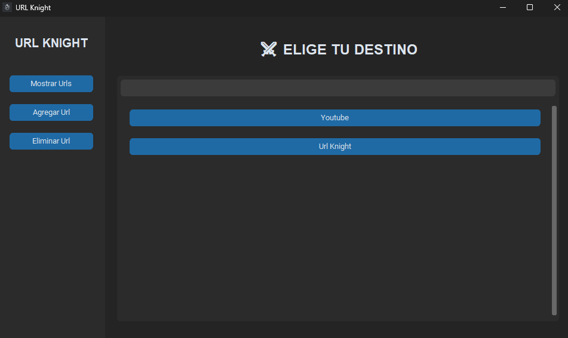

# UrlKnight ⚔️
Un administrador de enlaces ligero con persistencia local.
---

  
  
  

---
## 📝 Descripción

UrlKnight es una aplicación de escritorio con una interfaz gráfica moderna diseñada para gestionar accesos directos a URLs de forma eficiente. A diferencia de los marcadores tradicionales del navegador, esta aplicación permite centralizar enlaces de trabajo, estudio o herramientas frecuentes en un solo lugar.

Desarrollada en Python con CustomTkinter, la herramienta garantiza la persistencia de los datos mediante el almacenamiento automático en formato JSON dentro de la carpeta AppData, asegurando que tus accesos estén siempre disponibles, incluso tras reiniciar el equipo.

---

---
## 🛠️ Tecnologías Utilizadas

**Lenguaje**: Python 3.13.2

**Librerias**:

1. json: Para el almacenamiento y lectura de datos persistentes.

2. os: Para la gestión de rutas dinámicas y creación de directorios en el sistema.

3. webbrowser: Para la ejecución y apertura de enlaces en el navegador predeterminado.

4. customtkinter: Para la interfaz grafica

5. CTkMessagebox: Para ofrecer al usuario mensajes profesionales

6. pyinstaller: Para la exportacion del proyecto

--- 
## ⚙️ Requisitos

- Sistema operativo Windows (recomendado para la ruta automática de AppData).

## 📦 Descargas (Versión Ejecutable)

¿No tienes Python instalado? No hay problema. 
Puedes descargar la última versión estable del **UrlKnight.exe** directamente desde la pestaña de [Releases/Actions] de este repositorio. Solo descarga, ejecuta y listo. ⚔️

---

### ⚠️ Nota sobre Windows SmartScreen

Al ser un software de código abierto y no tener una firma digital pagada, Windows puede mostrar un aviso de **"Editor desconocido"**. 

**Para ejecutarlo:** 1. Haz clic en **"Más información"**.
2. Luego selecciona **"Ejecutar de todas formas"**. 

Puedes revisar el código fuente en este repositorio si te genera cualquier dudas.